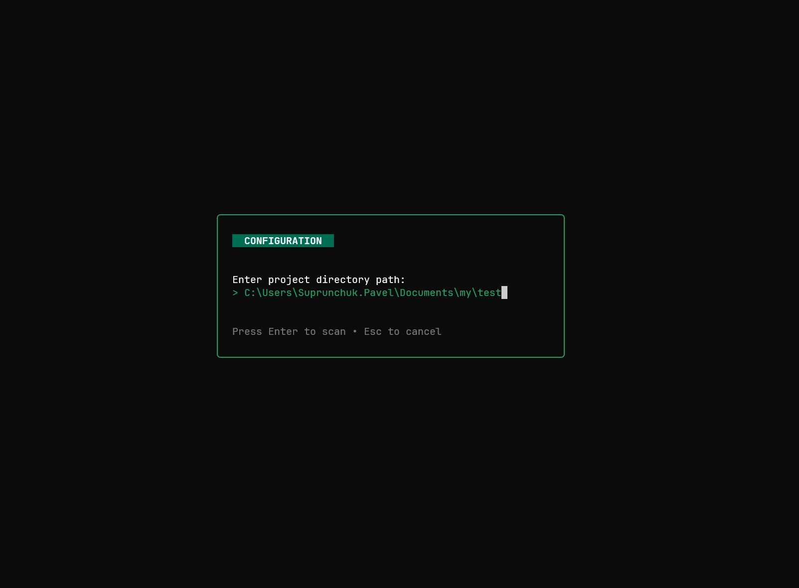

## 🚀 LazyPLCNext


### **LazyPLCNext** — это умный CLI-лаунчер для проектов Phoenix Contact PLCnext Engineer.

Больше не нужно вручную искать, какой версией `IDE` открывать старый проект. Лаунчер автоматически сканирует проекты, определяет их версию (даже внутри архивов) и запускает соответствующую установленную версию PLCnext Engineer.

## ✨ Возможности

### 🕵️ Умное сканирование:

- Распознает проекты в архивах (.pcwex).
- Распознает распакованные проекты (папки с Solution.xml).
- Поддерживает файлы-ссылки (.pcwef).

### 🧠 Автоопределение версии: 

Парсит XML-файлы проекта, чтобы узнать точную версию ProductVersion, в которой он был создан.

### ⚡ Автозапуск: 

Находит нужную версию IDE в `C:\Program Files\PHOENIX CONTACT` и запускает проект без лишних кликов.

### 🛡️ Контроль процессов: 

Если запущена неверная версия IDE, лаунчер предложит автоматически закрыть её перед запуском новой, чтобы избежать конфликтов.

### 🖥️ TUI Интерфейс: 

Удобный и быстрый консольный интерфейс (на базе Bubble Tea) с фильтрацией и навигацией клавиатурой.

### 🔄 Автообновление: 

Лаунчер сам проверяет наличие новых версий на GitHub, скачивает их и перезапускается одной кнопкой.

## 📸 Скриншот (Demo)



## 📥 Установка

1. Перейдите в раздел [Releases](https://github.com/suprunchuk/LazyPLCNext/releases).

2. Скачайте последний `LazyPLCNext.exe`.

3. Разместите файл в любой удобной папке (например, на Рабочем столе или добавьте в PATH).

4. Создайте для `.exe` файла ярлык и закрепите в меню Пуск.

__Требование__: Утилита работает только на Windows, так как PLCnext Engineer является Windows-приложением.

## 🎮 Использование

1. Запустите `LazyPLCNext.exe`.

2. `Первый запуск`: Введите путь к папке, где хранятся ваши проекты (например, `C:\Users\User\Documents\work`).

3. Выбор проекта:

    - Используйте стрелки ↑ и ↓ для навигации.

    - Начните вводить название для фильтрации списка.

4. `Запуск`: Нажмите Enter на выбранном проекте.

## ⚙️ Как это работает?

### Логика поиска версий

Лаунчер ищет установленные версии IDE по пути:

`C:\Program Files\PHOENIX CONTACT\`

Он ожидает стандартную структуру папок Phoenix Contact, например:

- PLCnext Engineer 2021.0.3
- PLCnext Engineer 2022.6

### Файл конфигурации

Настройки хранятся в файле `launcher_config.json` рядом с исполняемым файлом:

```json
{
  "work_dirs": [
    "D:\\My_PLC_Projects"
  ]
}
```

## 🛠️ Сборка из исходников (для разработчиков)

Если вы хотите доработать проект, вам понадобится Go 1.20+.

1. Клонируйте репозиторий:

```Bash
git clone https://github.com/suprunchuk/LazyPLCNext.git
```

```Bash
cd LazyPLCNext
```

2. Установите зависимости:

```Bash
go mod download
```

3. Запустите проект:

```Bash
go run main.go
```

4. Сборка EXE файла:

```Bash
go build -ldflags="-s -w" -o LazyPLCNext.exe main.go
```

## 🤝 Вклад в проект (Contributing)

Нашли баг или есть идея для фичи?

1. Откройте Issue.
2. Сделайте Fork репозитория.
3. Отправьте Pull Request.